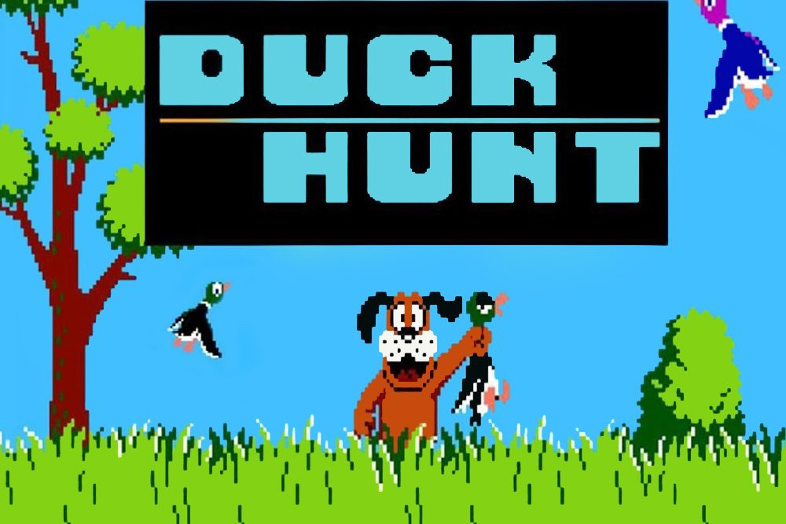

# Duck Hunt 3D

I and two friends designed a three-dimensional take on the original Duck Hunt game. This project let us explore our interest for 3D graphics and animation, along with game design.

Check out the game here: https://duckhunt3d.netlify.app/

### Table of contents

1. [Introduction](#introduction)
1. [Advanced Features](#advanced-feature)
1. [Authors](#authors)
1. [References](#references)

### Introduction <a name="introduction"/>

---

  

Duck hunt is a classic game released in 1984 by Ninetendo for the Nintendo Entertainment System. The premise of the game is that ducks appear randomly on screen and the user shoots projectiles in order to hit the ducks. We recreated the game in a 3D environment where the ducks appear at random depths and heights and the user aims using their mouse as a first-person shooter. The player gets 10 bullets and 2 extras per duck they hit.

The scene features grass composed of individual blades of **grass**, with random colors, swaying patterns and positions. In the background **trees** are randomly generated upon initialization as well. The tree's trunk and branches have different positions and directions with each scene. In addition there are 2 rocks on each side of the scene, to give a more natural feel to the scene. There is a blue **skybox** with white clouds moving across. The camera follows the position of the users mouse, and so does their **gun**. The **bullet** exits with a velocity along the axis of the gun, allowing for intuitive game play. **Ducks** spawn with random initial positions and flap their wings as they move in both directions across the player's screen. A **scoreboard** remains on the player's screen and displays how many ducks they have hit and how many bullets they have remaining. Hitting a duck gives the shooter 2 more bullets. When the player runs out of bullets the game ends.

Images of components of our scene are posted below:

**Ducks:**

**Gun:**

**Grass:**

**Trees:**

**Skybox with Rotating Clouds:**

**Scoreboard:**

**Ground Texture:**

### Advanced Features <a name="advanced-feature"/>

---

To tell whether a bullet hits a duck we implemented **collision detection**. We implemented a capsule implementation, where the duck is composed of 3 capsules. The first capsule runs along the length of the ducks body, from its beak to tail. The other two each run along a wing. The capsule method is very convenient because it can be reduced to a point-line distance problem. The spherical bullet is reduced to a point and radius, and each capsule is reduced to a line and radius. Then using the known point-line distance equation, the distance between the point and each line is calculated. If any of the distances are less than the bullet's radius plus the capsule's radius, then a collision is returned.

To make the first-person shooter experience more real we implemented **mouse picking** in our weapon. By finding the projection angle between the gun origin position and the aiming position (mouse location) we rotated the gun object the corresponding angle. To get the mouse position we added an event handler to the canvas and projected the mouse position to the camera position. Then we found the vector betweeen the gun and the mouse position, and used a rotation matrix in the appropriate axes to follow where the mouse is moving.

### References <a name="references"/>

---

#### Original Duck Hunt Game

[Screenshot:](https://www.pinterest.com/pin/356277020521935984/)

#### Ducks

[Examples of resources for bird animation - Kestrel Moon Youtube Channel](https://www.youtube.com/channel/UCPqZjHnq8U1hFehOUqEmgyQ)

 

[Examples of resources for bird animation:](OpenGameArt.org)

 

#### Collision Detection

[Point-line distance formula:](https://www.math.kit.edu/ianm2/lehre/am22016s/media/distance-harvard.pdf)

 

[Capsule sphere collision detection depiction:](https://arrowinmyknee.com/2021/03/15/some-math-about-capsule-collision/)

#### Obj Files Used:

[Grass obj](https://github.com/petoalbert/flora/blob/gh-pages/grass.obj) (modified)

[Gun obj](https://free3d.com/3d-model/american-civil-war-pistol-n2-v1--903079.html)

[Bird obj](https://www.cgtrader.com/free-3d-models/animals/bird/vulture-3d-model-lowpoloy)

[Rock obj](https://www.cgtrader.com/items/894881/download-page)

### Authors <a name="authors"/>

---

##### Daniel Ferguson

- Email: danferg1@hotmail.com
- Github: Daniel-Ferguson1

##### Jorge De Dios Suarez

- Email: jorgdd@hotmail.com
- Github: jorgdd

##### Ian Conceicao

- Email: IanCon234@gmail.com
- Github: IanConceicao
